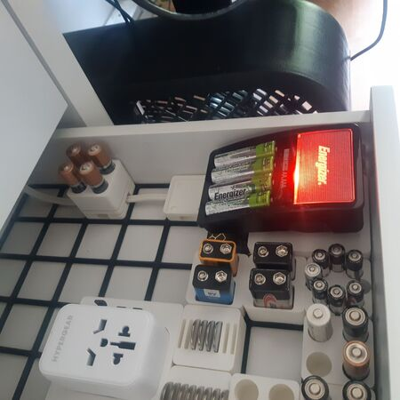
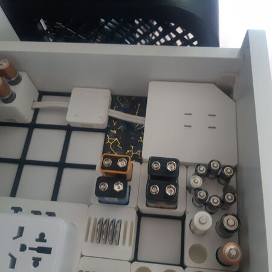

# Cables

 

Managing cables and putting power extensions on Gridfinity.

The extension cord I used can be found [here](https://www.canadiantire.ca/en/pdp/noma-6-ft-7-in-16-2-light-duty-extension-cord-with-3-outlets-white-0522412p.html?rq=extension+cord).

BTW, there's room to place weights inside the box.

## About the cable passages

Both top and bottom parts of the cable passage are 1 unit so each part can be reused individually as spacers.

The cable could be thick and hard to hold in place, I recommend using magnets.
