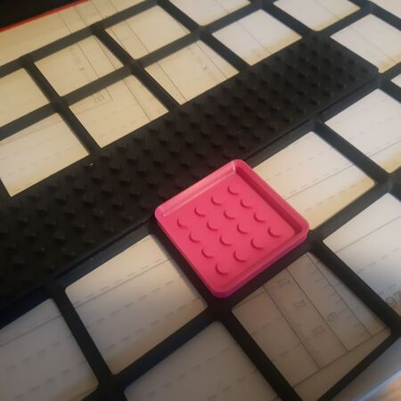

# Lego

The lego specs doesn't line up one to one with Gridfinity. 1x1 works with max 25 pins, but 1x2, 1x3 and 1x4 won't match. 1x5 worked well.

The pegs follow the lego specs, but doesn't feel very tight on the printed pieces, small pieces like characters might not be stick very well.
